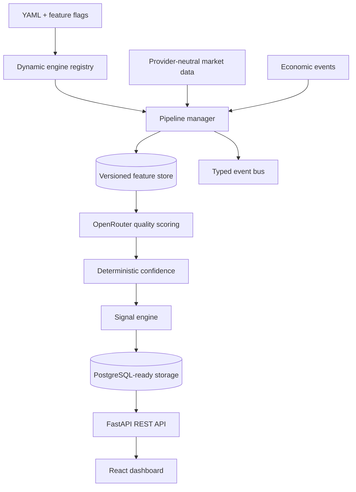

# TEN

TEN's Market Data Engine is the provider-neutral single source of truth for historical, realtime, and replayable market observations. It includes TwelveData, Alpha Vantage, Financial Modeling Prep, and OANDA adapters; health-ranked automatic failover; deterministic validation and quality scoring; memory/persistent caching; SQLAlchemy persistence; DST-aware sessions; metrics; events; and time-travel APIs. See [Market Data Engine](docs/MARKET_DATA_ENGINE.md).

The [SMC Engine Production 1.0](docs/SMC_ENGINE.md) provides deterministic no-lookahead structure, displacement, imbalance, institutional-zone lifecycles, dealing ranges, multi-timeframe context, durable replay, typed events, and structural features without generating trading decisions.

The [Liquidity Engine Production 1.0](docs/LIQUIDITY_ENGINE.md) owns inferred equal-level clusters, buy-side and sell-side pools, sweep classifications, session and period references, confluence, analytical target priority, replay-safe lifecycle history, and durable checkpoints. It consumes Market Data and the public SMC liquidity contract and never represents inferred liquidity as observed broker stops or order-book orders.

The [Volume Profile Engine Production 1.0](docs/VOLUME_PROFILE_ENGINE.md) owns deterministic candle-volume allocation across price, POC, Value Area, HVN/LVN, shelves, profile gaps, shapes, migration, period/anchored/composite profiles, tested references, replay, and durable checkpoints. Candle and tick volume limitations remain explicit; outputs are analytical observations rather than order-flow facts or trading instructions.

The [Market Regime Engine Production 1.0](docs/MARKET_REGIME_ENGINE.md) synthesizes time-valid Market Data, SMC, Liquidity, Volume Profile, and Institutional Flow outputs into deterministic and explainable regime context. It classifies conditions only and never emits trading instructions.

**TEN is an AI-assisted XAU/USD market analysis and signal-intelligence platform.** It combines independent price-action, liquidity, flow-estimation, volume-profile, macro-risk, and AI quality-scoring engines into explainable market scenarios presented through an internal dashboard.

TEN is not a trading bot. It has no broker connection, order execution, or Telegram integration. Signals are analytical scenarios—not financial advice.

## Foundation

- Python 3.12, FastAPI, Pydantic v2, SQLAlchemy 2, async PostgreSQL
- React, TypeScript, Vite, responsive institutional-style dashboard
- Clean Architecture boundaries, dependency injection, typed engine ports
- Dynamically discovered, semantic-versioned engine registry and factory
- YAML-configurable pipeline, feature flags, event bus, and versioned feature store
- External plugin entry points for AI, market data, analysis, and notifications
- Deterministic confidence calculator; the LLM never determines confidence
- OpenRouter-only AI client using `meta-llama/llama-3.3-70b-instruct`
- Docker Compose for backend, frontend, and PostgreSQL
- pytest, Ruff, ESLint, TypeScript, and GitHub Actions quality gates

## Architecture



See [Architecture](docs/ARCHITECTURE.md), [Configuration](docs/CONFIGURATION.md), the [Engine Catalog](docs/ENGINES.md), [Engine Development](docs/ENGINE_DEVELOPMENT_GUIDE.md), and [Plugin Development](docs/PLUGIN_DEVELOPMENT.md).

## Quick start

### Local development

Requirements: Python 3.12+, Node.js 22+, and PostgreSQL 16 if persistence is enabled.

```bash
cp .env.example .env
python -m venv .venv
# Windows: .venv\Scripts\activate
# Unix: source .venv/bin/activate
pip install -e ".[dev]"
uvicorn backend.app.main:app --reload
```

In another terminal:

```bash
cd frontend
npm install
npm run dev
```

Open `http://localhost:5173`; API documentation is at `http://localhost:8000/docs`.

### Docker Compose

```bash
cp .env.example .env
docker compose up --build
```

The dashboard is served at `http://localhost:5173`, the API at `http://localhost:8000`, and PostgreSQL at `localhost:5432`.

### Railway

The repository includes [`railway.json`](railway.json) for a Railpack backend
deployment. It starts the nested FastAPI application with Railway's assigned
port and verifies `/health` before marking a deployment healthy.

1. Create a Railway service from `Typhon-Namira/Ten`.
2. Keep the service root directory at the repository root.
3. AI Scoring Production 1.0 is deterministic and requires no LLM or provider API key.
4. Add a Railway PostgreSQL service and set `TEN_DATABASE_URL` to its async
   SQLAlchemy URL when durable persistence is enabled.
5. Generate a public domain under the service's Networking settings.

The backend start command is:

```bash
uvicorn backend.app.main:app --host 0.0.0.0 --port $PORT
```

The React dashboard is a separate deployable frontend. Create another Railway
service rooted at `/frontend`, set `VITE_API_URL` to the public backend URL,
build with `npm run build`, and serve the generated `dist` directory as a
static site.

## Development workflow

```bash
pytest
ruff check backend tests
cd frontend && npm run lint && npm run build
```

The default API starts without a database connection and uses in-memory signal, feature-store, and event-bus adapters so architecture work remains testable offline. The SQLAlchemy models provide the production PostgreSQL schema boundary; durable adapters and migrations should be added when ingestion persistence is enabled.

## Add an engine

Create a package under `backend/app/engines` containing configuration, typed models, interface, implementation, and `registration.py`. The loader discovers it automatically; select its version and order in YAML. Keep provider DTOs outside the engine and never call another engine. Full guidance is in [ENGINE_DEVELOPMENT_GUIDE.md](docs/ENGINE_DEVELOPMENT_GUIDE.md).

## Add an AI model

TEN currently permits **OpenRouter only**. Implement the provider-neutral `OpenRouterClient` or an external `AIProviderPlugin`, validate output into `SignalScore`, and register the adapter. Add an immutable prompt file for behavior changes. Models see `FeatureSnapshot` data only—never engine objects or raw chart images—and cannot set confidence.

## Repository map

```text
backend/app/       API, registry, pipeline, events, features, plugins, engines, AI
frontend/src/      Routed dashboard modules, typed API client, hooks, components
configs/           Provider and engine configuration examples
data/              Local development data (ignored except marker)
docs/              Architecture, API, and engine development guidance
tests/             API and per-engine unit/validation tests
docker/            Production-oriented container definitions
.github/workflows/ Continuous integration
```

## Data integrity

The institutional-flow baseline is explicitly an **OHLCV estimate** using volume pressure, close location, acceleration, and effort-versus-result. It does not claim access to CME order flow. A future licensed provider can implement the same contract without changing downstream scoring or signal construction.
## Institutional Flow Engine

TEN includes a persistent, replay-safe Institutional Flow Engine that synthesizes typed Market Data, SMC, Liquidity, and Volume Profile evidence into explainable probabilistic inferences. It does not claim verified institutional identity and produces no trading instructions. See [docs/INSTITUTIONAL_FLOW_ENGINE.md](docs/INSTITUTIONAL_FLOW_ENGINE.md).

## Economic Calendar Engine

TEN includes a provider-neutral, persistent, revision-aware Economic Calendar Engine with deterministic event identity, explicit publication/availability semantics, point-in-time replay, instrument relevance, bounded event-risk context, typed Feature Store/Event Bus integration, and read-only APIs. It produces probabilistic context only and no trading instructions. See [docs/ECONOMIC_CALENDAR_ENGINE.md](docs/ECONOMIC_CALENDAR_ENGINE.md).

## AI Scoring Engine

TEN includes a deterministic, explainable, point-in-time-safe AI Scoring Engine that combines versioned upstream intelligence into separate direction, confidence, risk, alignment, quality, and composite dimensions. It uses no LLM in Production 1.0 and never executes trades or emits trading instructions. See [docs/AI_SCORING_ENGINE.md](docs/AI_SCORING_ENGINE.md).
