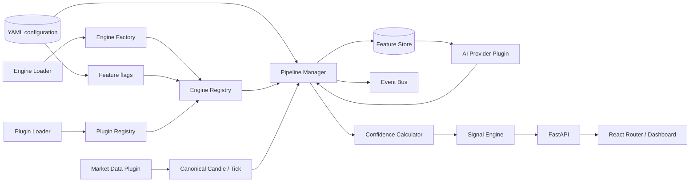
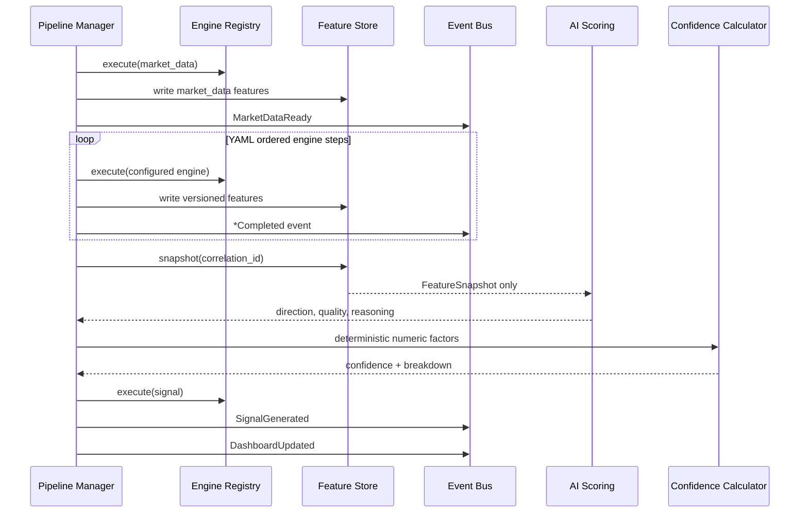

# TEN architecture

TEN is an event-observable, configuration-driven modular monolith. Provider adapters normalize external data, dynamically discovered engines produce versioned features, optional AI assesses only a feature snapshot, deterministic policy calculates confidence, and the signal engine creates a non-executable scenario.

## System dependency flow

Dependencies point toward contracts. Engine packages do not import FastAPI, SQLAlchemy, the dashboard, or another engine. The pipeline manager invokes registry executors and exchanges state through `PipelineExecutionContext`, `FeatureStore`, and typed events.

## Configurable execution and event flow

Every run has a correlation ID. Feature records contain engine semantic version and compatibility version, enabling replay and comparison when multiple versions coexist.

## Core boundaries

| Boundary | Responsibility | Extension mechanism |
|---|---|---|
| `EngineLoader` | Discover `registration.py` hooks | Add an engine package |
| `EngineFactory` | Store builders/executors by name and semantic version | Register another compatible version |
| `EngineRegistry` | Apply YAML selection and feature flags; own instances | Change `engine_registry.yaml` |
| `PipelineManager` | Validate dependencies and execute YAML order | Change `pipeline.yaml` |
| `EventBus` | Typed in-process publish/subscribe | Subscribe without changing producers |
| `FeatureStore` | Persist structured, versioned engine features | Add PostgreSQL/Redis/vector adapter |
| `PluginLoader` | Discover external `ten.plugins` entry points | Install an external plugin package |
| `ConfidenceCalculator` | Weighted deterministic confidence | Change `confidence.yaml` |

## Engine versioning

Each registration exposes:

- stable engine name;
- semantic implementation version (`1.0.0`);
- compatibility version (`1.0`);
- creation date;
- lifecycle status;
- dependencies and description;
- default enabled state, config key, and optional feature flag.

The factory keys definitions by `(name, version)`. Registry configuration selects a version, so future versions can coexist without changing consumers.

## Explicit non-goals

- no broker connectivity or order placement;
- no real CME order-flow claim when only OHLCV estimates exist;
- no raw chart input to the AI layer;
- no LLM-generated confidence;
- no market-regime detection, replay execution, or AI-memory adapter yet;
- no notification or Telegram implementation.
# Market-data single source of truth

All current and future engines must obtain normalized market observations from the Market Data Engine. Provider adapters, validation, quality, failover, cache, persistence, replay, sessions, and raw metrics are documented in [MARKET_DATA_ENGINE.md](MARKET_DATA_ENGINE.md).
