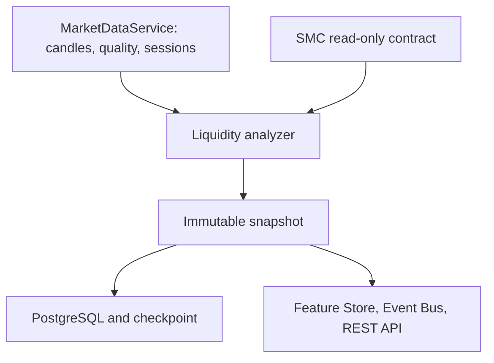

# Liquidity Engine Production 1.0

The engine infers price-action liquidity from replay-visible Market Data and provider-neutral SMC structure. It does not observe broker stops or a complete order book, infer institutional intent, or emit trades.

Market Data owns observations, provider access, calendars and quality. SMC owns swings, structure, displacement, imbalances, blocks and dealing ranges. Liquidity owns equal-level clusters, buy/sell pools, session and period references, configured round levels, lifecycle, sweeps, grabs, raids, price-action stop-hunt labels, false breaks, confluence, inferred-density map data and analytical target priority.

SMC-confirmed swings are primary inputs; optional micro-candle references are configured. Effective equality tolerance is the maximum of absolute, tick, ATR and percentage tolerances. Sorted candidates are clustered, touch-gated and outlier-filtered. UUIDv5 identities, source IDs, machine-readable evidence and availability timestamps make results deterministic and explainable.

A sweep requires post-availability pool penetration. Wick rejection differs from close-through; a grab is rapid rejection; a raid affects multiple pools; a stop hunt is only a price-action classification; a false break requires a later visible reclaim. No classification proves manipulation.

Sessions use Market Data's IANA timezone/DST/holiday-aware classifier. Previous day/week/month levels become available only after the source period completes. Round levels are symbol-configured and confidence-capped. Higher-timeframe context never exposes an unfinished boundary.

Targets use deterministic distance, strength, freshness, scope and quality factors. Intermediate pools produce obstruction/accessibility scores. `inferred_density` map bands are not Level 2 orders.

Snapshots, immutable object versions and SHA-256-validated checkpoints use conflict-safe indexed PostgreSQL writes. Startup reports recovery state. Memory fallback is explicitly degraded/ephemeral. `/liquidity` exposes bounded read-only health, metrics, config, state, snapshot, objects, classifications, sessions, references, confluences, targets, map, MTF and replay endpoints.

Clustering is `O(n log n)`. Lifecycle evaluation is bounded by configured candles and active pools and may approach `O(p*n)` in dense cases. The engine cannot guarantee price movement or observe actual resting orders.

## Domain and lifecycle

Snapshots contain immutable levels, equal-level clusters, pools, analytical events, sweeps, grabs, raids, stop-hunt classifications, false breaks, session ranges, reference levels, inducements, confluences, target rankings, inferred map bands and multi-timeframe context. Every object carries a deterministic UUIDv5 identity, symbol/timeframe, source and availability time, confidence/quality/strength where applicable, configuration and engine versions, source references and analysis boundary.

All confidence, quality, strength, freshness, density and accessibility scores are deterministic and bounded from 0 through 100.

The validated lifecycle is `DETECTED -> PENDING_CONFIRMATION -> CONFIRMED -> ACTIVE`, followed by `APPROACHED`, `TOUCHED`, `PARTIALLY_SWEPT`, `SWEPT`, `RAIDED`, `RECLAIMED` or `CONSUMED`; invalidated and expired versions can only archive. Terminal objects never reactivate as the same version. Repeated analysis at one boundary produces identical identities and repository writes are conflict-safe.

## Equal levels, pools and confluence

SMC-confirmed internal/external swings are primary candidates. Optional micro-candle liquidity is separately identified. Absolute, tick-size, ATR-normalized and percentage tolerances combine by taking the strict instrument-aware maximum. Candidates are sorted, incrementally clustered, minimum-touch gated and outlier rejected. Overlapping same-side/same-scope levels merge into composite pools; different scopes remain distinct, allowing nested liquidity. Constituents remain traceable so a cluster and its derived pool are not counted as independent confluence evidence.

Pool strength separates touch evidence, scope, freshness, source quality and confidence. Active-set and candle counts are configuration bounded. Minor internal liquidity lying between price and a larger external same-side target is exposed as uncertain inducement evidence linked to that target; it is not an SMC block or structural detector.

## Sweeps and outcomes

A wick-only sweep penetrates and closes back inside. Close-through penetration remains continuation/consumption unless a later candle visibly reclaims within the configured window, in which case it is a false break. A grab is immediate rejection. A raid groups multiple pools removed at the same visible boundary. A stop hunt requires configured classification confidence and is explicitly a price-action label, never evidence of actual broker orders or manipulation. Events retain penetration, reclaim, time-outside, response and lifecycle evidence; no field is a trade result.

## Sessions, periods and round numbers

Session ranges use `MarketSessionEngine` and therefore IANA timezone, DST, weekend and supplied holiday semantics—no UTC offset is embedded in Liquidity domain logic. Developing and completed high/low ranges have explicit availability. Previous and developing day/week/month references are derived only from candles visible at the boundary. Round levels use configuration-provided symbol increments, tick-normalized bands, distance limits and a confidence cap; the domain has no XAU-specific constant.

## Ranking, path, map and multi-timeframe

Analytical target priority combines relative distance/accessibility, strength, freshness, scope and data quality with deterministic UUID tie-breaking. Intermediate same-side pools produce obstruction scores. Consumed, invalidated and expired pools are excluded. Outputs contain no entry, stop, take-profit, position sizing, expected return or buy/sell instruction.

Map records use the unambiguous field `inferred_density`, plus price band, side, source count, weighted strength, timeframe composition, lifecycle, distance, confidence and age. They are not order-book heatmaps. Service-level MTF aggregation follows the configured bounded hierarchy (`M1` through `D1`, with `W1`/`MN1` represented only when supported), calls Market Data per normalized timeframe, and records an `analyzed_through` boundary that cannot exceed replay time.

## Persistence and recovery

`liquidity_snapshots` stores exact replay boundaries; `liquidity_objects` stores immutable logical object versions; `liquidity_checkpoints` stores the last series state plus SHA-256 integrity hash. PostgreSQL writes use one commit after conflict-safe snapshot/object/checkpoint statements. Reads are indexed and bounded by series/time. Startup validates payload, engine version and state hash; corrupt checkpoints are ignored safely. PostgreSQL mode reports healthy durable state. Explicit memory mode reports `degraded` with `ephemeral_persistence`.

## Features, events, API and metrics

The `liquidity` Feature Store namespace publishes nearest and strongest buy/sell pools, active equal highs/lows, period and session levels, latest sweep/raid/reclaim, inducements, confluences, target rankings, inferred density above/below, path obstruction, MTF context, confidence, quality, timestamp, snapshot ID and versions. Publication is idempotent per snapshot.

Typed events cover cluster confirmation, pool creation/approach/touch/partial sweep/sweep/consumption/expiry, grabs, raids, stop-hunt labels, false breaks, sessions, references, confluence, ranking, degraded inputs, checkpoint recovery, replay completion and analysis update. Event UUIDs are deterministic from event type and source object; payloads carry correlation, source IDs, symbol/timeframe, event/availability time, confidence and versions.

All `/liquidity` routes are GET-only. Collection `offset` and `limit` are bounded to 5,000; replay requires an ISO timestamp. Health exposes dependency, persistence and recovery state without credentials. Metrics include analysis/candle/reference counts, every classification, active/terminal pool counts, replay/recovery and failure counts, average latency, repository mode and the latest successful timestamp.

## Configuration and measured performance

`configs/liquidity.yaml` is parsed into frozen Pydantic groups and content-versioned. Overrides are validated, including bounded scores, tolerance availability and ranking weights summing to one. On the validation host, a dense deterministic benchmark measured 2,000 M1 candles in 0.416 seconds with 1.07 MiB traced peak memory and 10,000 candles in 1.372 seconds with 3.56 MiB. Candidate sorting is `O(n log n)`; insertion is constant-time using running group sums. The bounded pool/candle lifecycle remains worst-case `O(p*n)`, so the engine does not claim global linear complexity.
