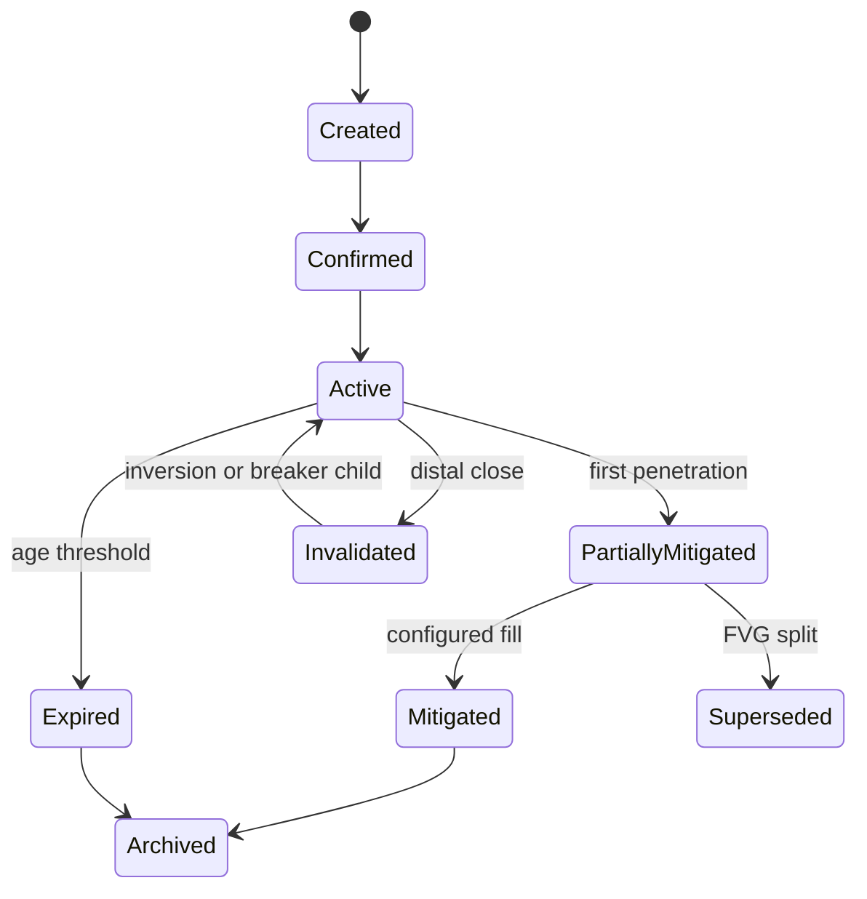
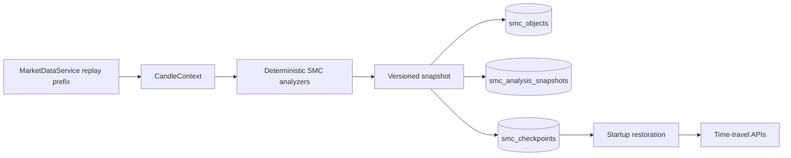

# Smart Money Concepts Engine — Production Version 1.0

TEN's SMC Engine converts normalized candles into deterministic structural facts. It is an analytical layer, not a signal generator, and does not claim to infer actual institutional intent. SMC terminology varies across methodologies; the definitions below are the exact TEN rules.

## Boundary and data flow

`MarketDataService → CandleContext → SwingDetector → StructureAnalyzer → SMCAnalysisSnapshot → existing FeatureStore/EventBus`

Only `MarketDataService` supplies candles. The engine has no provider, broker, network, normalization, session, cache, signal, execution, or AI integration. All read APIs are bounded and all persisted payloads contain engine and stable configuration versions.

## Deterministic methodology

The candle context requires one canonical symbol and timeframe, strictly increasing unique timestamps, and enough history for the configured pivot window. It calculates true range/ATR and propagates the existing candle quality score. Below-threshold input produces `degraded_input` and confidence penalties rather than being silently discarded.

Swings use configurable left/right pivot windows. A candidate at candle `i` is available only when candle `i + right_window` has closed. Stable identifiers include the source timestamp, type, timeframe, symbol, and configuration version. Minimum separation, absolute/ATR excursion, strength, internal/external classification, source IDs, quality, and confidence are recorded. Batch, incremental prefix, and replay processing therefore share the same availability rule.

Internal and external directions are maintained independently. A confirmed break in a neutral or matching direction is BOS. An opposing break is CHoCH and leaves the relevant scope transitional unless displacement crosses the MSS threshold and satisfies the configured protected/external rule; then it is MSS. Each structural level is broken at most once per analysis. The initial analysis boundary may seed a neutral-to-directional BOS when the final close confirms a break of the preceding range.

Close, wick, and hybrid confirmation are configurable, together with absolute and ATR-normalized break distance. Evidence contains the broken level, displacement result, input quality, thresholds, confirmation candle, invalidation rule, and detection version. Historical classification never uses wall-clock time.

## State, persistence, and replay

`SwingPoint`, `StructureLeg`, `StructureEvent`, `Displacement`, `SMCZone`, `DealingRange`, `StructureLiquidityReference`, `MultiTimeframeContext`, `MarketStructureState`, and `SMCAnalysisSnapshot` are immutable Pydantic contracts. The SQLAlchemy PostgreSQL adapter is selected automatically when the configured database is reachable and falls back explicitly to bounded in-memory storage when unavailable. Conflict-safe object-version and snapshot writes preserve lifecycle history; `smc_checkpoints` restores the newest state per series at startup. The idempotent production migration is `migrations/20260717_smc_v1.sql`.

Replay asks `MarketDataService.replay` for the visible candle prefix and derives a replay-mode snapshot. A swing cannot appear before `confirmed_at`; structural events cannot reference future confirmation candles. Historical corrections use the configured bounded recalculation window.

## Events, features, and API

The existing Event Bus receives typed structure, displacement, imbalance, void, Order Block, Breaker, Mitigation Block, dealing-range, lifecycle, MTF, degraded-input, analysis-updated, and replay events. Stable snapshot IDs make repeat publication idempotent. The Feature Store receives every bounded object payload, lifecycle, confidence, quality, analytical timestamp, processing mode, and version. No entry, exit, stop, target, size, order, recommendation, or profitability field is published.

Read-only endpoints are `${TEN_API_PREFIX}/smc/state`, `/swings`, `/structure`, `/events`, `/displacements`, `/zones`, `/liquidity-references`, `/dealing-ranges`, `/multi-timeframe`, `/snapshot`, `/replay`, `/health`, `/metrics`, and `/config`; with the default empty prefix they begin at `/smc`. Object routes support filters, offsets, time travel, and limits capped at 5,000.

## Configuration and complexity

`configs/smc.yaml` defines pivot, structure, displacement, imbalance, Order Block, dealing-range, MTF, quality, batching, recalculation, checkpoint, expiration, mitigation, and active-object settings. The SHA-256-derived configuration version changes whenever serialized settings change.

Context, displacement, imbalance, lifecycle, and structure scans are `O(n)` with configuration-bounded active sets and lookbacks; swing ordering is `O(s log s)`. Repository queries use `(symbol, timeframe, analysis_timestamp)` indexes.

## Object detection and lifecycle

Displacement combines ATR-normalized impulse, body ratio, directional efficiency, optional rolling-volume confirmation, consecutive-candle impulse grouping, confidence, and bounded invalidation. Three-candle FVGs are available only on the third closed candle, filtered by absolute and ATR size, merged when overlapping, split after partial fills, decayed, mitigated, expired, or converted to inversion FVGs after distal-close invalidation. Strong impulses may create liquidity voids.

Order Blocks require a structural event, validated displacement, and the last qualifying opposing candle inside the bounded lookback. Body refinement and optional volume confirmation are configurable. Invalidated blocks convert to lineage-linked Breakers; partial returns produce Mitigation Blocks. Every zone transitions through active, touched/partial, mitigated, superseded, invalidated, broken, or expired states with immutable versions.

Dealing ranges are anchored by alternating confirmed swings and expose range high/low, equilibrium, premium/discount boundary, OTE, golden zone, direction, scope, and nesting metadata. MTF analysis reads only Market Data Engine candles through the requested timestamp for M1, M5, M15, M30, H1, H4, and D1; W1 and MN1 directions are deterministic calendar aggregations of visible D1 candles.

## Liquidity ownership boundary

TEN's dedicated `liquidity_engine` owns equal-high/equal-low clustering, buy/sell-side pools, session/previous-period liquidity, sweep/raid/stop-hunt lifecycle, heatmaps, and target ranking. SMC publishes only confirmed-swing and inducement references needed by its own validation. Optional sweep evidence enters through the read-only `LiquidityFeatureReader` protocol; evidence whose availability time is after the snapshot boundary is rejected.

## Lifecycle flow

## Replay and restart flow

