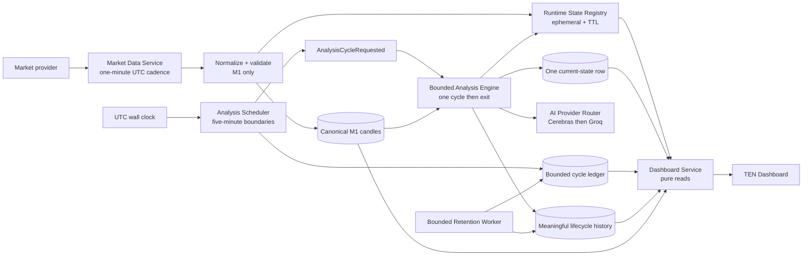
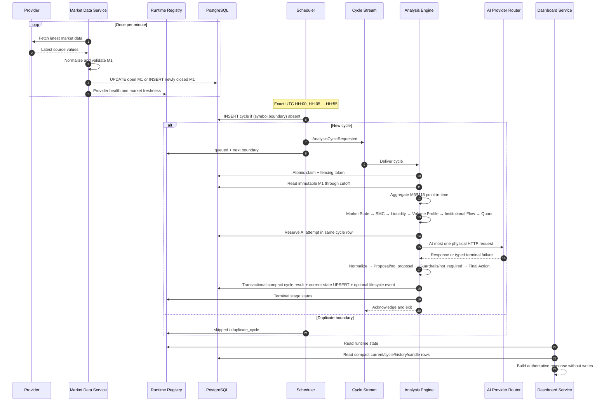
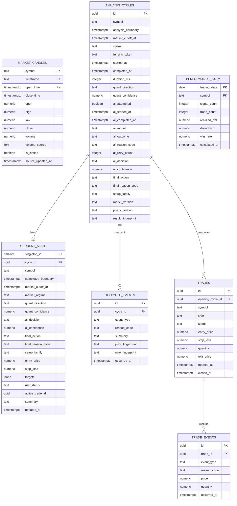

# TEN Architecture V2 — Audited Design Proposal

Status: **design revision 2; implementation is not authorized**

This proposal is the authoritative target design. It replaces revision 1 where the two conflict. The companion [mandatory design audit](./ten-architecture-v2-mandatory-audit.md) records the violations found, writer and reader inventories, failure matrix, storage calculation, and implementation gates.

## Product invariants

1. The Market Data Service runs once per minute and may only fetch, normalize, validate, update the open M1 candle, insert a newly closed M1 candle, and update ephemeral provider/freshness state.
2. Market polling never runs analysis, AI, decisions, publication, or analytical persistence.
3. The complete analytical cycle starts only at UTC `HH:00`, `HH:05`, …, `HH:55`.
4. `(symbol, analysis_boundary)` identifies one authoritative cycle. Duplicate scheduler or queue delivery cannot execute it twice.
5. A live cycle makes one logical AI request through the Cerebras-primary/Groq-fallback router; each provider may receive at most one transient retry.
6. Dashboard endpoints are pure reads and cause zero database or runtime-state writes.
7. Heavy inputs and intermediate analytical objects remain in memory.
8. PostgreSQL stores canonical M1 candles, bounded cycle control/results, one current-state row, and meaningful lifecycle records only.
9. An unchanged WAIT cycle updates current state and the bounded cycle ledger but creates no lifecycle-history event.
10. WAIT is a complete terminal outcome, not a partially completed pipeline.
11. Closed M1 candles are immutable. M5 and M15 are point-in-time aggregations from M1 and are not stored.
12. The normal PostgreSQL growth budget for one active symbol is **≤ 2 MiB/day**, with a hard acceptance ceiling of **5 MiB/day** including indexes.
13. Runtime statuses are exactly `healthy`, `running`, `degraded`, `failed`, `disabled`, `blocked`, `stale`, and `no_data`. Generic `Unavailable` is forbidden.

## 1. Architecture



### Component boundaries

| Component | Permitted work | Prohibited work |
|---|---|---|
| Market Data Service | Fetch latest market data; normalize and validate; update the open M1; insert a newly closed M1; set ephemeral health/freshness | Higher-timeframe storage, analytics, AI, decisions, publication, analytical snapshots |
| Analysis Scheduler | Calculate UTC boundary; create/dedupe cycle; enqueue once; expose next boundary | Analytics, provider polling, AI, dashboard reconstruction |
| Analysis Engine | Claim one cycle; select cutoff; compute all engines in memory; call AI at most once; produce compact result; finalize runtime state; exit | Polling loop, relative sleeps, full-payload persistence, implicit retries |
| Runtime State Registry | Latest stage/service state, exact reason, durations, next retry, TTL | Durable decision authority, analytical history, hidden business state |
| Dashboard Service | Purely read registry and compact PostgreSQL rows; return one contract | Any write, refresh heartbeat, provider request, analysis, inferred completion |
| Retention Worker | Bounded cleanup of explicitly expirable rows | Cleanup as primary storage control, audit/trade deletion, unbounded operations |
| Gap Repair Command | Operator-controlled insertion of missing closed M1 rows | Changing existing closed candles, triggering analysis, automatic live backlog |

### Analytical chain

```text
Point-in-time M1 view
→ deterministic M5/M15 aggregation
→ Market State
→ SMC
→ Liquidity
→ Volume Profile
→ Institutional Flow
→ Quant Forecast
→ AI Reasoning
→ optional Proposal
→ Guardrails
→ Final Action
→ current-state UPSERT
→ optional meaningful lifecycle event
→ exit
```

Every stage returns a typed, compact in-memory result:

```text
status, reason_code, concise_summary, downstream_fields,
started_at, completed_at, duration_ms
```

Complete candle arrays, engine objects, profiles, evidence trees, graphs, matrices, prompts, and provider responses are released when the cycle exits.

## 2. Component interaction



## 3. Runtime and durable authority

| Class | Examples | Authority | Recovery |
|---|---|---|---|
| Runtime-only | Active stage, provider health, next poll, progress, retry time, transient diagnostics | Redis hashes/streams with TTL | Reconstructed from clock, latest M1, current state, active cycle; transient stage becomes `no_data` until observed |
| Current durable state | Latest completed boundary, latest Quant/AI/final result, active trade ID, current risk | Singleton PostgreSQL row | Direct read after restart |
| Historical durable event | Material regime change, actionable signal, named rejection, publication/cancel/entry/close/invalidation, material risk change, terminal failure | PostgreSQL lifecycle/trade tables | Retained by policy |
| Bounded cycle control | Boundary identity, claim, timing, AI attempt metadata, compact terminal result | PostgreSQL cycle ledger | Scheduler/worker idempotency and recent audit |
| Metric/log | Latency distributions, polling success, duplicate suppression, full stack traces | Metrics/log platform | Operational retention; not business authority |
| Restricted diagnostic archive | Optional encrypted prompt/response for an explicitly enabled incident | External object store, never normal PostgreSQL | Seven-day TTL and access audit |

Redis is never authoritative for a completed result. PostgreSQL is never used to reconstruct in-flight stage progress. When Redis is unavailable, ingestion and analysis may continue if PostgreSQL is healthy; the dashboard returns durable current state plus `degraded` runtime status with `runtime_registry_unavailable`. When Redis returns, services republish their current state. No hidden state is required to understand a durable decision.

## 4. Runtime state model

```text
RuntimeState
  schema_version
  revision
  observed_at
  deployment_generation
  market_poll
  analysis_cycle
  stages[]
  database

StageState
  name
  status
  reason_code
  exact_reason
  cycle_id
  started_at
  completed_at
  duration_ms
  last_success_at
  stale_after
  retry_at
```

Registry writes require a monotonic revision and current fencing token. Events from older cycles or deployments are rejected. `stale` is calculated from the stored time and stage-specific TTL; missing initial state is `no_data`.

### Complete WAIT state

For every valid non-actionable cycle:

```text
Quant: completed
AI Reasoning: completed
AI Proposal: no_proposal or not_required
Guardrails: not_required
Final Action: WAIT
Publication: not_required
Monitoring: not_required
Outcome: not_applicable
Cycle: completed
```

No WAIT response may contain “Awaiting AI Proposal,” “Not Yet Persisted,” “No Managed Signal,” or “Evaluation Horizon Not Complete.”

## 5. Database schema



### Schema constraints

- `market_candles` accepts only `timeframe = 'M1'`.
- Primary key: `(symbol, timeframe, open_time)`.
- The live writer may update OHLCV only when the existing row is open. `false → true` is the only allowed `is_closed` transition. Any later change fails with `closed_candle_immutable`.
- `analysis_cycles` is unique on `(symbol, analysis_boundary)`.
- `current_state.singleton_id` is constrained to `1`, so the table has exactly one row after initialization.
- `lifecycle_events` is unique on `(cycle_id, event_type, new_fingerprint)` to suppress duplicate meaningful events.
- `targets` is allowed only for an actionable result, is limited to a short numeric array, and cannot contain analytical evidence.
- `TRADES.opening_cycle_id` references `analysis_cycles.id`; `trade_events.trade_id` references `trades.id`.
- Audit foreign keys use `ON DELETE RESTRICT`.
- The schema contains no full-payload JSONB, evidence frame, analytical snapshot, prompt, provider response, graph, or repeated candle collection.

### Required indexes

- `market_candles (symbol, open_time DESC)`
- partial `market_candles (symbol, open_time DESC) WHERE is_closed`
- unique `analysis_cycles (symbol, analysis_boundary)`
- `analysis_cycles (status, analysis_boundary DESC)`
- `lifecycle_events (occurred_at DESC, event_type)`
- `lifecycle_events (cycle_id)`
- `trades (status, opened_at DESC)`
- `trade_events (trade_id, occurred_at)`

## 6. Candle policy

### Higher timeframes

M5 and M15 are never persisted. At analysis boundary `B`, the engine reads closed M1 candles whose close time is `<= B`, groups them into UTC-aligned intervals, and emits an M5/M15 bar only if all required M1 members are present and closed. Aggregation is deterministic and point-in-time.

### Gap repair

- The live poller detects and reports gaps but does not expand its allowed work.
- A separate operator-controlled repair command may insert missing historical M1 rows in bounded batches of at most 500.
- Repair never changes an existing closed row and never triggers live analysis.
- A repaired gap becomes available only to future live cycles. Historical replay is separately controlled and AI-disabled by default.

### Late corrections

- A late value for an existing closed M1 candle is rejected and logged as `late_closed_candle_conflict`.
- The conflicting source fingerprint and candle key go to restricted operational logs, not PostgreSQL payload history.
- An actual correction requires a separately reviewed administrative procedure. V2 does not silently rewrite or overlay immutable market history.

### Retention

Closed M1 candles remain hot for 24 months. Later archive/removal requires a verified external archive and separate approval. Open rows transition to closed; there is at most one open M1 per symbol.

## 7. Scheduler and AI idempotency

The scheduler uses UTC:

```text
analysis_boundary = floor(now_utc / 5 minutes) × 5 minutes
cycle_key = (symbol, analysis_boundary)
next_boundary = analysis_boundary + 5 minutes
```

It waits for an absolute boundary, never a startup-relative interval. On a boundary:

1. Insert `analysis_cycles` under the unique boundary.
2. Publish only if the insert succeeds.
3. The worker atomically claims `queued → running` and increments the fencing token.
4. Duplicate delivery observes the claimed/terminal row and acknowledges without analysis.
5. Before AI, the same row is atomically changed from `ai_attempted=false` to `true`.
6. Only that update owner may make the HTTP request.

The live scheduler may recover the current boundary only within 90 seconds. Older boundaries become `skipped/scheduler_misfire`; there is no live backlog replay.

The provider router allows at most one bounded retry for transient network or 5xx failures per provider. Authentication, quota, rate-limit, request-validation, decoding, and domain failures are not retried. A terminal provider failure still completes the cycle with deterministic WAIT.

## 8. Dashboard contract

`GET /api/v2/dashboard/state` is a pure read. It writes neither PostgreSQL nor Redis.

```text
DashboardState
  schema_version
  observed_at
  deployment_generation
  market_data
    status, reason_code, exact_reason
    cycle_started_at, cycle_completed_at, duration_ms
    next_poll_at, retry_at, last_success_at
    latest_closed_m1_at, freshness_seconds
  analysis
    status, reason_code, exact_reason
    active_cycle_id, active_boundary
    latest_completed_boundary, next_boundary
    started_at, completed_at, duration_ms, retry_at
  stages
    market_state
    smc
    liquidity
    volume_profile
    institutional_flow
    quant
    ai_reasoning
    proposal
    guardrails
    final_action
    publication
    monitoring
    outcome
  current_result
    quant, ai, proposal, guardrails, final_action
    confidence, setup_family, risk, concise_summary
  database
    status, reason_code, exact_reason
    allocated_bytes, used_bytes, free_bytes
    growth_bytes_per_day, circuit_open, last_success_at
  performance
  history
```

Every stage contains `status`, `reason_code`, `exact_reason`, `last_success_at`, `duration_ms`, and `retry_at` when applicable. The Dashboard Service obtains active runtime state from Redis and durable current/cycle/history from bounded PostgreSQL reads, then returns this single contract. The frontend does not join, infer, or translate missing relationships. Missing initial data is `no_data`.

## 9. Persistence policy and storage budget

### Persisted versus memory-only

| Persist | Why a future reader needs it |
|---|---|
| Canonical M1 OHLCV | Point-in-time analysis, charting, replay, gap detection |
| Bounded cycle row | Deduplication, claim recovery, AI accounting, recent operational audit |
| Singleton current state | Authoritative latest dashboard and restart recovery |
| Meaningful lifecycle event | Audit of a material state/action transition |
| Trade and trade event | Execution, monitoring, financial audit |
| Daily performance | Long-range performance dashboard/reporting |

Everything else is memory-only, metric/log data, or an explicitly enabled short-lived restricted diagnostic archive.

### Growth formula

```text
projected bytes/day =
Σ(rows created/day × average heap bytes/row × index amplification)
```

Updates to the singleton/current open candle count toward write I/O but not row-growth budget.

| Class | Maximum normal rows/day | Average heap bytes | Index amplification | Budget |
|---|---:|---:|---:|---:|
| Closed M1 candles | 1,440 | 240 | 1.60 | 552,960 B |
| Analysis cycles | 288 | 1,600 | 1.80 | 829,440 B |
| Meaningful lifecycle events | 100 | 800 | 1.80 | 144,000 B |
| Trades and trade events | 300 | 320 | 1.70 | 163,200 B |
| Daily performance | 1 | 400 | 1.50 | 600 B |
| Temporary terminal failures | Included in cycle/event ceilings | — | — | ≤ 102,400 B reserve |
| PostgreSQL diagnostics | 0 in normal operation | — | — | 0 B |
| Index/tuple overhead reserve | — | — | — | 262,144 B |

Projected ceiling:

```text
552,960 + 829,440 + 144,000 + 163,200 + 600 + 102,400 + 262,144
= 2,054,744 bytes/day
= 1.96 MiB/day
```

Restricted external diagnostics are separately capped at 256 KiB/day and seven days. The production-like storage test fails above **5 MiB/day per active symbol** or if any unclassified writer exists. Cleanup is not credited in this calculation.

## 10. Retention

| Data | Retention | Cleanup |
|---|---:|---|
| Closed M1 candles | 24 months hot | Archive proposal after verified backup; no initial deletion |
| Analysis cycles | 90 days | Bounded batches; preserve rows referenced by events/trades |
| Current state | Singleton indefinitely | UPSERT only |
| Lifecycle events | 1 year; 7 years when linked to trade/incident | Bounded batches, `ON DELETE RESTRICT` respected |
| Trades/trade events | 7 years minimum | No automated hard delete |
| Daily performance | 7 years | Bounded partition cleanup only after approval |
| Runtime state | 24-hour TTL | Redis expiry |
| Restricted incident diagnostics | 7 days | External lifecycle policy |
| Metrics/logs | 30 days hot | Observability-platform policy |

Cleanup runs are capped by rows and duration, pause on database load/replication lag, and emit rows/bytes reclaimed. No initial phase uses `VACUUM FULL`, `TRUNCATE`, `DROP`, or destructive production cleanup.

## 11. Migration and cutover

1. Approve this audited design and human decisions.
2. Add V2 schema, Redis contracts, metrics, and activation flags without routing production work.
3. Shadow the V2 M1 writer; prove one-minute cadence, deduplication, immutability, and zero analytical execution.
4. Backfill only deduplicated canonical M1 and compact continuity records; do not copy analytical payloads.
5. Run V2 scheduler in enqueue-disabled observation mode; prove exact UTC boundaries.
6. Run bounded V2 analysis shadow cycles with AI disabled; compare V1/V2 deterministic stages.
7. Enable one V2 shadow AI request per cycle; keep publication disabled; prove request idempotency and complete WAIT.
8. Measure heap/index/WAL growth against the 5 MiB/day hard gate.
9. Switch dashboard reads to V2 and verify refreshes generate zero writes.
10. Fence V1 scheduler/analysis writers using `TEN_V1_WRITERS_ENABLED=false` plus a database generation token.
11. Enable V2 as authoritative for analysis; verify one owner on the next boundary.
12. Stop all V1 full-payload writers within the bounded cutover window.
13. Observe production behavior and storage for the approved period.
14. Inventory and archive legacy data only after backup verification and separate approval.
15. Remove V1 code/tables only after explicit approval.

V1 and V2 full-payload writers may coexist only during the time-boxed shadow comparison. The kill switch defaults to V1 enabled until cutover and is independently reversible. It must be impossible for both generations to publish or call AI for the same boundary.

## 12. Rollback

- V2 schema is additive through cutover.
- V1 data remains intact and read-only after V2 activation.
- Dashboard, scheduler, analysis, AI, and publication routing are independently reversible.
- Database fencing tokens prevent a stopped generation from resuming ownership.
- Rollback disables V2 enqueueing, terminates/quarantines the in-flight cycle, verifies no second AI attempt, then enables the selected generation.
- V2 durable rows remain for audit; they are never expanded into V1 full payloads.
- No rollback step deletes data or reverses a production migration destructively.

Rollback triggers include duplicate cycles or AI requests, future-data leakage, unexplained decision divergence, dashboard writes, incomplete WAIT states, generic `Unavailable`, unbounded writers, or projected growth above the hard budget.

## 13. Acceptance gates

Implementation remains blocked until all are approved and testable:

- structural separation of one-minute polling and five-minute analysis;
- exact UTC boundary scheduling;
- one authoritative cycle and at most one AI HTTP request per boundary;
- write-free dashboard refresh;
- complete terminal WAIT semantics;
- memory-only heavy analytical objects;
- known, bounded PostgreSQL writers and real readers for every table;
- measured growth no greater than 5 MiB/day per symbol;
- V1 writer kill switch and generation fencing;
- documented rollback;
- no generic `Unavailable`;
- approved Redis, retention, correction, and AI-failure policies.

No code, migration execution, deployment, production change, commit, push, or pull request is authorized by this document.
